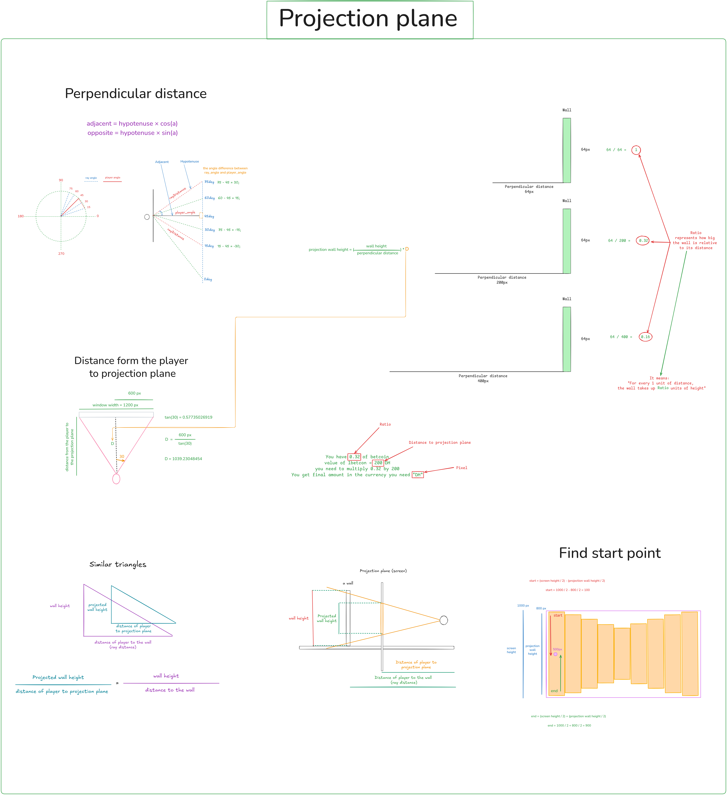

# 🧱 Cub3D

Cub3D is a 3D graphical project inspired by the classic game **Wolfenstein 3D**, built using **raycasting** to simulate a 3D environment from a 2D map.  
It’s one of the most iconic projects in the 42 curriculum, combining **mathematics**, **graphics programming**, and **game logic**.

---

## 🎯 Objective

The goal of this project is to create a simple **first-person 3D game engine** where the player can:
- Move forward, backward, and rotate the camera view.
- Visualize walls, textures, and maps using **raycasting**.
- Navigate through a world built from a `.cub` map file.

---

## ⚙️ Main Features

- 🧭 **Raycasting engine** — calculates wall intersections using trigonometry.  
- 🧱 **Textured walls** — displays different textures depending on wall orientation.  
- 🌈 **Ceiling & floor coloring** — customizable via configuration file.  
- 🎮 **Smooth player movement** — walking, strafing, and rotating.  
- 🪟 **Rendered window** — built using the MiniLibX graphics library.

---

## 📁 Project Structure
```
Cub3D/
├── src/ # Core source code
├── includes/ # Header files
├── textures/ # Wall and object textures
├── maps/ # .cub map files
└── Makefile # Compilation rules
```

---
<p align="center">
  <h1>🧱 Main concepts</h1><br>
</p>

## Field of View (FOV)

Field of View (FOV) represents the extent of the observable area that can be seen at any given moment, typically measured in degrees. In this raycasting implementation, the FOV determines how wide the player's viewing angle is.

### How It Works

- **FOV Angle**: Defines the total width of the visible area (e.g., 60 degrees)
- **Ray Calculation**: Rays are cast across the FOV to detect walls and objects
- **Ray Angle Distribution**: Each ray is calculated by dividing the FOV by the number of rays
  - Formula: `ray_angle = player_angle - (FOV / 2) + (FOV / number_of_rays) * i`
  - This creates an even distribution of rays across the viewing angle

### Example With a screen width of 1000 pixels and resolution of 4: - Number of rays = 250 (1000 / 4) Each ray represents a vertical slice of the screen
- Rays are cast incrementally across the FOV angle to build the 3D view

The resulting ray angles determine what the player sees, creating the illusion of depth and perspective in the rendered scene.


## Diagram


## Calculate Distance

Distance calculation is essential for determining how far a ray travels before hitting a wall or object. This distance is used to render walls at the correct height, creating the 3D perspective effect.

### Pythagorean Theorem

The distance between two points is calculated using the Pythagorean theorem:

Given two points: player position `(px, py)` and intersection point `(ix, iy)`

1. Calculate the horizontal and vertical differences:
   - `x = ix - px`
   - `y = iy - py`

2. Apply the Pythagorean theorem:
   - `distance² = x² + y²`
   - `distance = √(x² + y²)`

### Example
If the hypotenuse (distance) equals 9:
- `9² = 81`
- `x² + y² = 81`
- `distance = √81 = 9`

This distance value is crucial for rendering: the greater the distance, the shorter the wall appears on screen, creating the illusion of depth in the raycasting engine.


## Diagram


# Pixel to Grid Conversion

## Overview

This guide explains how to convert between pixel coordinates and grid cell coordinates in a tile-based system. This is essential for games, map editors, and any application that uses a grid-based coordinate system.

## Diagram


The diagram shows:
- A 16×16 grid represented as binary values (1s and 0s)
- A cell size (SQUARE) of 15 pixels
- An example conversion of grid position (1, 1) to pixel coordinates
- Visual representation of how grid cells map to pixel coordinates

---


# 🧭 Moving Player – Unit Circle Explanation

This diagram illustrates how player movement can be represented mathematically using the **unit circle** and **trigonometric functions**.  
It shows how to calculate horizontal (`x`) and vertical (`y`) components of movement based on a direction angle (`θ`) and a movement speed (`ms`).

---

## 📘 Concept Overview

The **unit circle** is used to describe directions and movement in 2D space using **angles**.  
A player moves along a vector defined by an angle (e.g., 45°) and a given movement speed.

- **Hypotenuse (`ms`)** → represents the movement speed or total distance moved.  
- **Opposite** → the vertical component (`y` axis movement).  
- **Adjacent** → the horizontal component (`x` axis movement).  
- **Angle (`θ`)** → the direction of movement, measured counterclockwise from the 0° (right) axis.

---

## 🧮 Trigonometric Relationships

From trigonometry:

sin(θ) = opposite / hypotenuse
cos(θ) = adjacent / hypotenuse


Therefore:
y = sin(θ) * ms
x = cos(θ) * ms


These equations give the change in position for a movement of length `ms` at angle `θ`.

---

## 🧠 Example at 45°

Given:
θ = 45°
ms = 1


sin(45°) = 0.5
cos(45°) = 0.7


x = ms * cos(45°) = 1 * 0.7 = 0.7
y = ms * sin(45°) = 1 * 0.5 = 0.5

### The player moves:

+0.7 units horizontally

+0.5 units vertically

## Diagram


---

# Raycasting Intersection Calculations

This document explains **Vertical** and **Horizontal Checking** methods used in raycasting to find wall intersections on a 2D grid map, as shown in the image.

---

## 📘 Overview

The image illustrates two main processes:

1. **Vertical Checking (Left Side)**  
   Used to calculate intersections where the ray crosses **vertical grid lines** (walls between columns).

2. **Horizontal Checking (Right Side)**  
   Used to calculate intersections where the ray crosses **horizontal grid lines** (walls between rows).

Both methods are essential for detecting walls when casting rays in a 2D environment (as in raycasting engines like Wolfenstein 3D or 42’s Cub3D project).

---

## 🔹 Vertical Checking

**Purpose:** Determine the first and subsequent intersections of the ray with vertical grid lines.

### Key Concepts
- `Xa` → Distance between consecutive vertical intersections on the x-axis.
- `Ya` → Distance between consecutive vertical intersections on the y-axis.
- Depends on whether the ray is facing **right** or **left**.

### Equations

For the first vertical intersection:
```
Bx = floor(Px / block_size) * block_size
if facing right:
    Bx += block_size
if facing left:
    Bx -= 1
By = Py + (Px - Bx) * tan(c)
```

For subsequent intersections:
```
if ray is facing right:
    Xa = block_size
else:
    Xa = -block_size
Ya = Xa * tan(c)
```

### Example:
Given `tan(60) = y / x`,  
```
x = y / tan(60)
y = x * tan(60)
```

---

## 🔹 Horizontal Checking

**Purpose:** Determine intersections with horizontal grid lines.

### Key Concepts
- `Ya` → Step size on y-axis between consecutive horizontal intersections.
- `Xa` → Step size on x-axis based on the ray’s slope (`tan(angle)`).
- Depends on whether the ray is facing **up** or **down**.

### Equations

For the first horizontal intersection:
```
Ay = floor(Py / block_size) * block_size
if facing down:
    Ay += block_size
if facing up:
    Ay -= 1
Ax = Px + (Py - Ay) / tan(c)
```

For subsequent intersections:
```
if ray is facing up:
    Ya = -block_size
else:
    Ya = block_size
Xa = Ya / tan(c)
```

### Trigonometric Reminder
```
tan(c) = Opposite / Adjacent
tan(c) = (Ay - Py) / (Ax - Px)
```

### Example:
```
tan(60) = y / x
x = y / tan(60)
y = x * tan(60)
```

---

## 🧭 Summary

| Concept | Vertical Check | Horizontal Check |
|----------|----------------|------------------|
| First Intersection | Based on vertical grid lines | Based on horizontal grid lines |
| Step Variables | Xa = ±block_size, Ya = Xa * tan(angle) | Ya = ±block_size, Xa = Ya / tan(angle) |
| Facing Conditions | Left / Right | Up / Down |
| Uses | x-axis intersection | y-axis intersection |

---

## 📷 Image Reference

The accompanying image (`get_intersection_points.png`) visually represents how vertical and horizontal ray intersections are calculated on a grid map.  
It includes geometric relationships, trigonometric derivations, and example visualizations for different ray angles (e.g., 60°).

---

## 🧮 Notes
- `Px`, `Py` = Player coordinates.
- `Bx`, `By` and `Ax`, `Ay` = Intersection points.
- `block_size` = Size of each grid square.
- `tan(c)` provides the slope of the ray line.

---
## Diagram


---
# Projection Plane — Raycasting Visualization

This document explains the **Projection Plane** concept used in raycasting engines to render 3D perspectives from a 2D map, as shown in the image `projection_plane.png`.

---

## 📘 Overview

The image illustrates how a 2D raycasting engine projects walls onto the screen based on the player’s point of view.  
It demonstrates key geometric and trigonometric relationships involved in converting real-world distances into screen pixel heights.

---

## 🔹 1. Perpendicular Distance

### Concept
When a ray is cast at an angle, the **measured distance** to a wall is **not perpendicular** to the player’s view direction.  
To avoid distortion (the *fish-eye effect*), the perpendicular distance must be used instead of the direct ray distance.

### Equations
```
adjacent = hypotenuse × cos(α)
opposite = hypotenuse × sin(α)
```
Here, α represents the angle between the ray direction and the player’s forward direction.

### Visualization
- Multiple rays are cast from the player’s position.  
- The perpendicular distance determines how “tall” a wall appears on screen.  
- The farther the wall, the shorter its projected height.

```
projection wall height ∝ 1 / perpendicular_distance
```

---

## 🔹 2. Distance from Player to Projection Plane

This section shows how the **projection plane** (the screen) is placed at a fixed distance in front of the player.

### Example
```
window width = 1200px
FOV = 60°
β = FOV / 2 = 30°

distance_to_projection_plane = (window_width / 2) / tan(β)
```
Result example:
```
distance_to_projection_plane ≈ 1039.23
```

This ensures that rays are evenly spaced across the player’s field of view, and each corresponds to one vertical stripe on the screen.

---

## 🔹 3. Similar Triangles

### Concept
The idea of **similar triangles** connects real wall heights to their projected sizes on the screen.

```
wall_height / distance_to_wall = projected_height / distance_to_projection_plane
```

Rearranging:
```
projected_height = (wall_height × distance_to_projection_plane) / distance_to_wall
```

This formula determines how tall a wall appears based on how far away it is.

### Visual Explanation
- The triangle formed by the wall and the player matches (is similar to) the triangle formed by the wall’s projection and the screen.  
- As the distance increases, the projected height decreases proportionally.

---

## 🔹 4. Projection Plane Geometry

- The **projection plane** acts like the virtual screen where 3D walls are drawn.  
- The **distance from the player to the projection plane** controls the scaling of projected wall heights.  
- The **ray angle** determines where on the screen each wall slice is drawn.

Each vertical line on the screen corresponds to one ray.

---

## 🔹 5. Find Start Point

This section explains how to calculate the starting drawing position for each wall slice.

### Formula
```
start_y = (window_height / 2) - (projected_wall_height / 2)
end_y = start_y + projected_wall_height
```
This ensures the wall slice is centered vertically on the screen.

### Visualization
- Walls closer to the player appear larger and start lower.  
- Distant walls appear smaller and higher on the screen.

---

## 🧮 Key Takeaways

| Concept | Formula / Meaning |
|----------|-------------------|
| Perpendicular distance | `dist × cos(angle_diff)` |
| Projection height | `(wall_height × dist_to_plane) / perp_dist` |
| Distance to projection plane | `(screen_width / 2) / tan(FOV / 2)` |
| Wall vertical start | `(screen_height / 2) - (proj_height / 2)` |

---

## 📷 Image Reference

The file **`projection_plane.png`** visualizes all these relationships, including:
- Perpendicular distance correction  
- Player-to-plane distance derivation  
- Similar triangle relationships  
- Calculation of projected wall heights  
- Determination of wall drawing start point


---
## Diagram


---
# 🟦 Drawing a Circle

This diagram visually explains how to draw and define a **circle** using its **mathematical equation** and coordinate geometry.

---

## 📘 Overview

The image demonstrates:
- A circle centered at the origin `(0,0)`
- A radius `r = 1`
- Key points around the circle at 0°, 90°, 180°, and 270°
- The **standard equation of a circle** and how to determine if a point lies **inside** or **outside** the circle

---

## 🧮 Standard Equation of a Circle

The general formula for a circle is:

\[
(x - cx)^2 + (y - cy)^2 = r^2
\]

Where:
- `cx` → x-coordinate of the circle’s center  
- `cy` → y-coordinate of the circle’s center  
- `r` → radius of the circle

---

## ⚙️ In This Example

- **Center** → `(0, 0)`  
- **Radius** → `r = 1`

Equation becomes:

\[
(x - 0)^2 + (y - 0)^2 = 1^2
\]
or simply  
\[
x^2 + y^2 = 1
\]

---

## 📍 Points and Verification

| Point (x, y) | Calculation | Result | Position |
|---------------|-------------|---------|-----------|
| (1, 1) | (1 - 0)² + (1 - 0)² = 2 | ≠ 1 | Outside |
| (1, 0) | (1 - 0)² + (0 - 0)² = 1 | = 1 | On circle |
| (1, -1) | (1 - 0)² + (-1 - 0)² = 2 | ≠ 1 | Outside |
| (0, -1) | (0 - 0)² + (-1 - 0)² = 1 | = 1 | On circle |
| (-1, -1) | (-1 - 0)² + (-1 - 0)² = 2 | ≠ 1 | Outside |
| (-1, 0) | (-1 - 0)² + (0 - 0)² = 1 | = 1 | On circle |
| (-1, 1) | (-1 - 0)² + (1 - 0)² = 2 | ≠ 1 | Outside |
| (0, 1) | (0 - 0)² + (1 - 0)² = 1 | = 1 | On circle |
| (0, 0) | (0 - 0)² + (0 - 0)² = 0 | < 1 | Inside |

---

## 🧭 Circle Orientation

- **0°** → Rightmost point `(1,0)`
- **90°** → Topmost point `(0,1)`
- **180°** → Leftmost point `(-1,0)`
- **270°** → Bottommost point `(0,-1)`

The image also shows a radius line and quadrants divided by the X and Y axes.

---

## 🖼️ Image Reference


